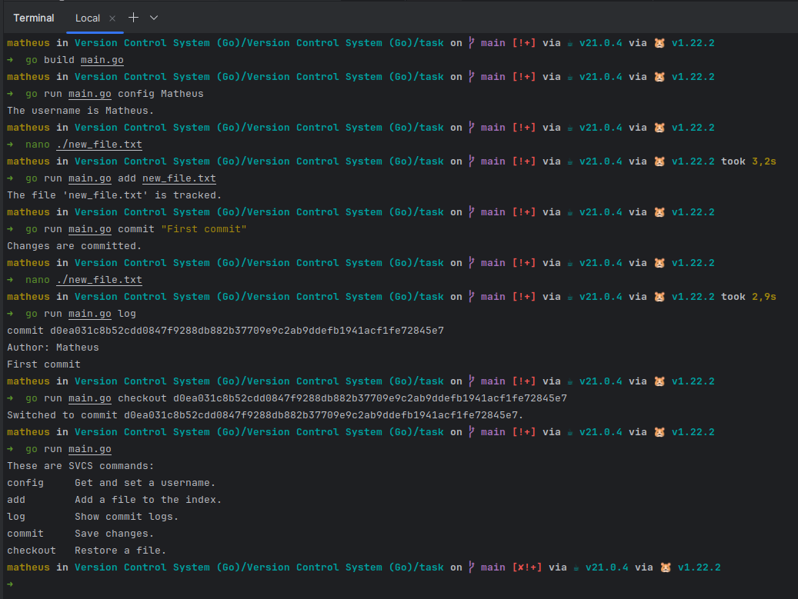

### Projeto - [Version Control System (Go)](https://hyperskill.org/projects/420)

Provided by Jetbrains Academy, este projeto é uma implementação de um sistema de controle de versão de arquivos, similar ao Git, em Go.

Aplicados conceitos de hash, árvore de diretórios e arquivos, e manipulação de arquivos para desenvolver uma aplicação CLI que pode rastrear alterações de arquivos.


#### Como usar:
```bash
    These are SVCS commands:
    config     Get and set a username.
    add        Add a file to the index.
    log        Show commit logs.
    commit     Save changes.
    checkout   Restore a file.
```
